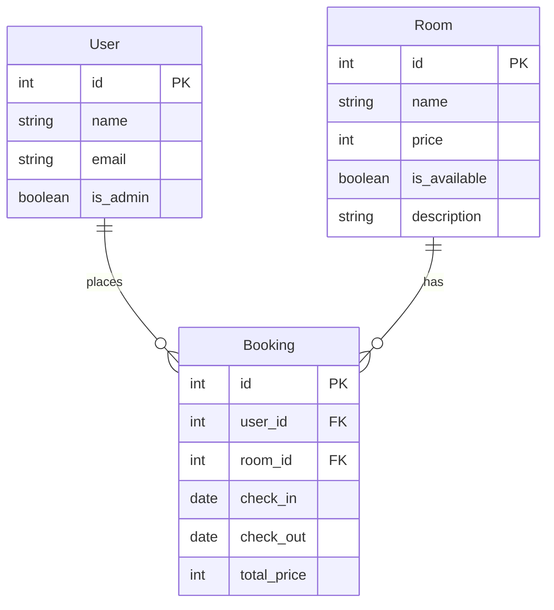

# Trishul Eco-Homestays

Trishul Eco-Homestays is a sustainable village tourism platform designed for travelers seeking authentic cultural immersion and eco-friendly stays in Chopta, Uttarakhand.

## Overview

The platform connects conscious travelers with local village communities, offering:
- Authentic local homestay experiences.
- A sustainable livelihood stream for remote villagers.
- Preservation of the pristine Himalayan environment through eco-tourism practices.

## Technologies Used
- React + Vite
- TypeScript
- Custom Vanilla CSS (Design System)
- React Router DOM
- Lucide React (Icons)

## Getting Started

### Frontend Setup

To run the frontend project locally:

1. Clone the repository
2. Run `npm install` to install dependencies
3. Run `npm run dev` to start the local development server at `http://localhost:8000`

### Backend Setup

To run the Python/FastAPI backend locally:

1. Navigate to the `api` folder: `cd api`
2. Create and activate a virtual environment (`python -m venv venv`, then `venv\Scripts\activate` on Windows or `source venv/bin/activate` on Mac/Linux)
3. Install dependencies: `pip install -r requirements.txt`
4. Copy `.env.example` to `.env` (if exists) and configure variables including your `DATABASE_URL`.
5. Start the development server: `uvicorn index:app --reload --port 5000`

## Database Choice & Setup

### Choice: PostgreSQL (via Supabase)
We chose **PostgreSQL** hosted on **Supabase** because our data (Rooms) is highly structured and relational. The fields (`name`, `price`, `is_available`, etc.) are well-defined and predictable, making a SQL relational database the perfect fit. Supabase also provides an excellent connection pooler for serverless deployments.

### Setup Instructions
1. Go to [Supabase](https://supabase.com) and create a free project.
2. Generate a secure database password and save it.
3. Once the database is provisioned, go to **Project Settings -> Database**.
4. Enable **Use connection pooling** and copy the **Session pooler** URI.
5. In the `api` folder, copy `.env.example` to `.env`.
6. Set `DATABASE_URL` to the copied URI, replacing `[YOUR-PASSWORD]` with your actual password.
7. Run `python index.py` (or start `uvicorn`) locally. SQLAlchemy will automatically create the required tables in Supabase on startup.

### Schema Diagram
The database relies on PostgreSQL via Supabase and uses SQLAlchemy (see `api/models.py`). Below is the schema layout for the core entities:

